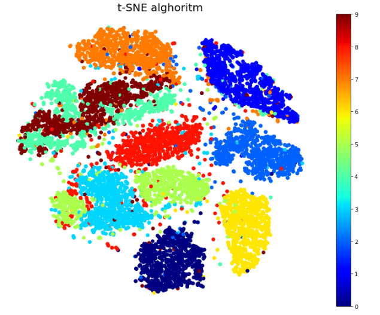
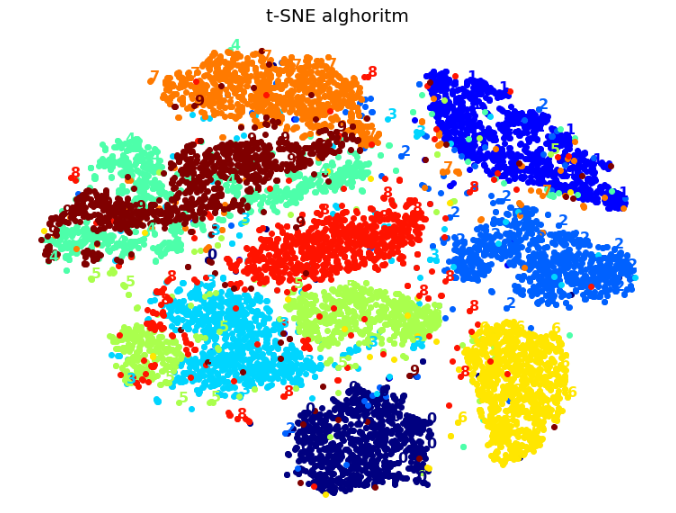
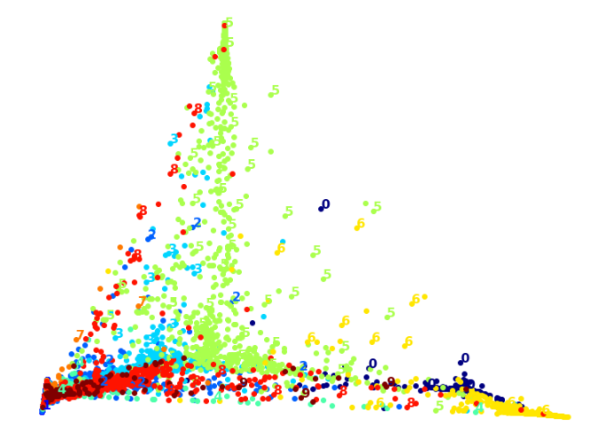
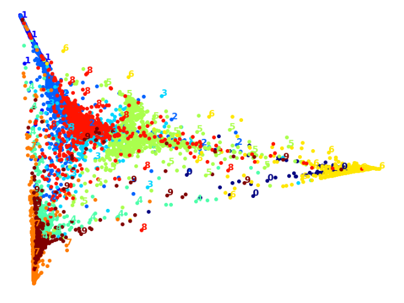
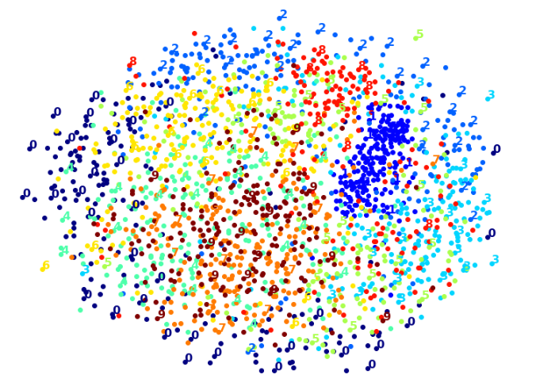
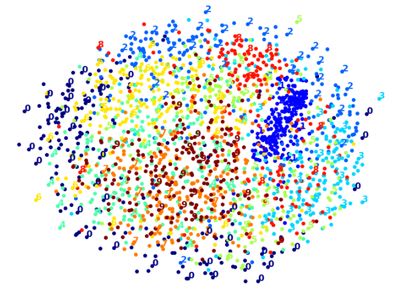
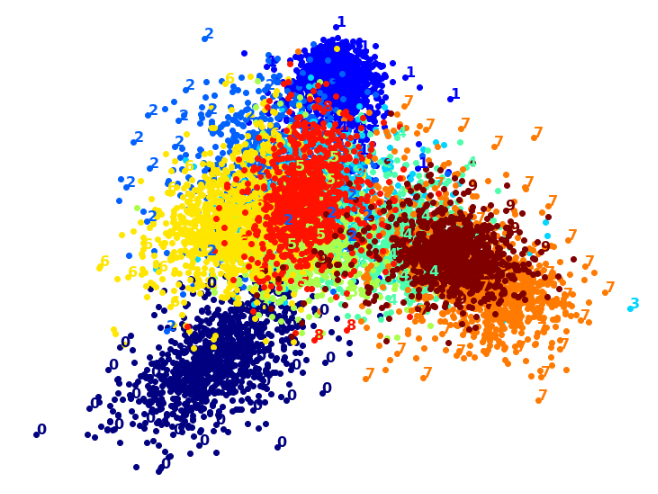

**Introduction**

MNIST dataset is one of the most popular and investigated dataset in machine learning world. It consists of 784 features
which corresponds to grayscale of 28x28 pixels matrix and 70 000 images as rows.

**Analyzed problem**

Use different classification models to achieve the most accurate classifier on high dimension dataset. 
Investigate:
- how dimensionality reduction algorithms affects accuracy and learning time
- how dimensionality reduction help to visualize high dimension dataset and make them more understandable
 to the business and client.

**Selected solution**

Random forest classifier and logistic regression models were built and training time and accuracy were checked.
Then combination of this model with PCA algorithm was trained.
Randomized PCA in combination with Random forest classifier was tested.

Another part of the project was visualization part where different dimensionality reduction algorithms such as t-SNE, 
PCA, LLE, MDS, LDA and combination of PCA with MDS and PCA with LLE were used to visualize
MNIST dataset on 2 dimension space.

**Results and conclusions**

Dimensionality reduction algorithms usually do not improve accuracy because it's always involved with information loss.
They can speed up the training time but it's not a rule. Every case has to be investigated individually and method
adjusted to the expected results.
In this case, for logistic regression, the training time  of a model has decreased but accuracy both for logistic
regression and random forest regression were lower.
Surprisingly the randomized PCA in combination with RF achieved high accuracy: 91%.
For data visualization t-SNE  algorithm gives the best result, most of numbers were separated into clusters, looking
really well on a plot.

Any of other dimensionality reduction algorithm didn't gave comparable results:

- Principal Component Analysis

- Locally Linear Embedding

- PCA + LLE

- Multi Dimension Scaling (MDS)

- PCA + MDS

 - Linear Discriminant Analysis
 
 

