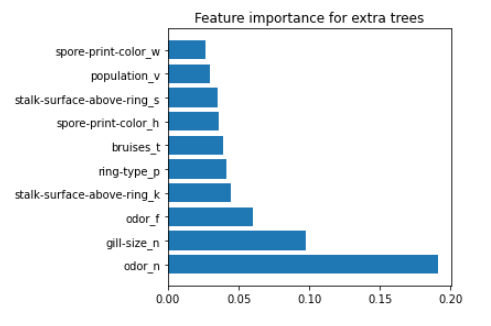
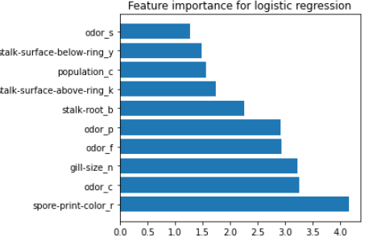
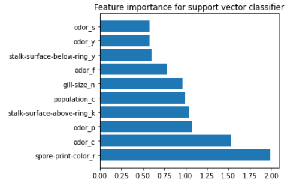

**Introduction**

This dataset includes descriptions of hypothetical samples corresponding to 23 species of gilled
mushrooms in the Agaricus and Lepiota Family Mushroom drawn from The Audubon Society Field
Guide to North American Mushrooms (1981). Each species is identified as definitely edible,
definitely poisonous, or of unknown edibility and not recommended. This latter class was combined
with the poisonous one. The Guide clearly states that there is no simple rule for determining the
edibility of a mushroom. Donated to UCI ML 27 April 1987.

**Analyzed problem**

We have given 23 attributes for mushrooms such as : 
cap-shape, cap-surface, cap-color, bruises, odor, gill-attachment, gill-spacing, gill-size, gill-color,
stalk-shape, stalk-root, stalk-surface-above-ring, stalk-surface-below-ring, stalk-color-above-ring,  
stalk-color-below-ring, veil-type, veil-color , ring-number, ring-type, spore-print-color, population,
habitat. 
*Mushrooms are labeled as poisonous or edible.*
The task is to use those features to classify mushrooms into one of the above groups.

**Purpose**

Build mushroom classifier with the highest precision using ensemble learning methods.
Compare training time for "soft" and "hard" voting affects model accuracy.

**Selected solution**

Use different classifiers and their ensembles to recognize poisonous and edible mushrooms
by their attributes.
Use different accuracy metrics and classification report to assess classifier accuracy.
Examine feature importance for different algorithms.

**Results and conclusions**

Mushroom dataset is really clean and all classifiers reach nearly 100% accuracy. It is rare to get such
score but possible. Dataset is clean, balanced ( around half of samples belong to each class), data was splitted
into training and testing dataset and all features encoded.
Logistic regression and random forest classifier have the shortest training time: for LR around 0.2 seconds
and for RF: 0.6 seconds. Hard voting classifier was trained much quicker than "soft" version - it may be caused by 
additional operation of averaging the probability of belonging to particular classes. But with another model,
it can achieve higher accuracy.
Feature importances were investigated for each classifier:
 - for random forest and extra trees the most important features were: odor, gill size, stalk surface above ring,
 ring type and bruises;

 
 - for logistic regression: spore print color, odor, gill size and stalk root;
 

- for support vector classifier: spore print color, odor, stalk surface above ring, population and gill size.

For logistic regression and support vector classifier some features play a significant
role almost equally. For random forest and extra trees feature importance were more diverse.

