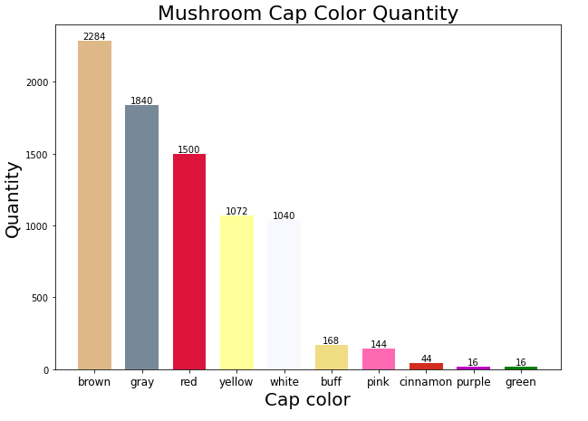
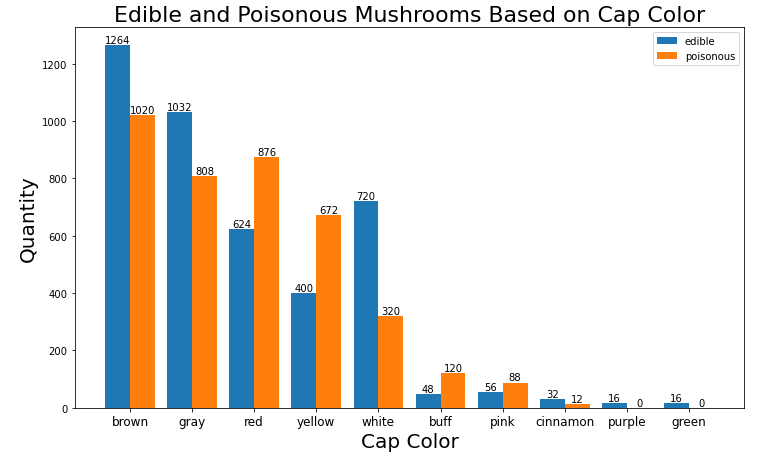
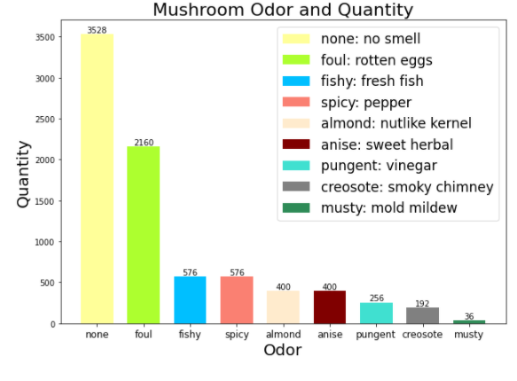
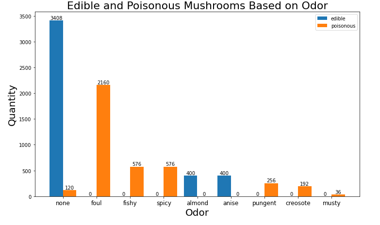
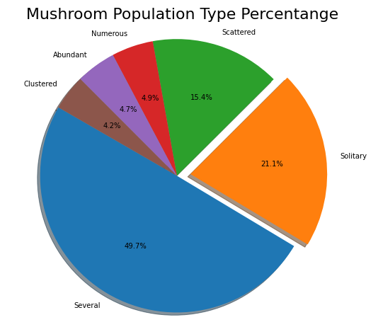
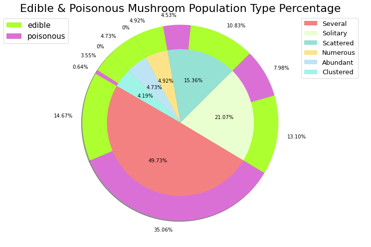
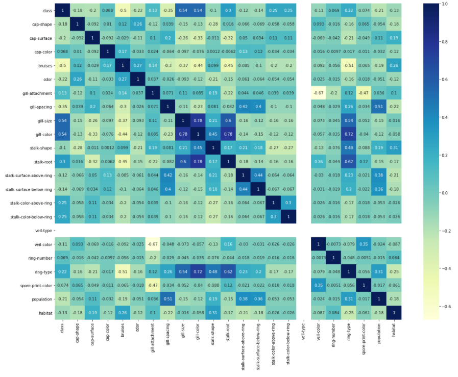
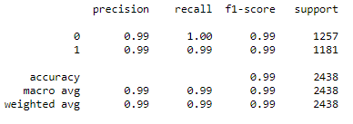
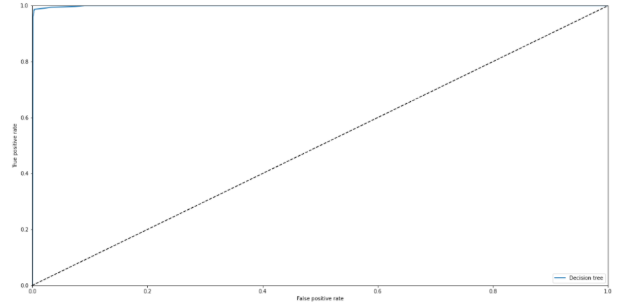
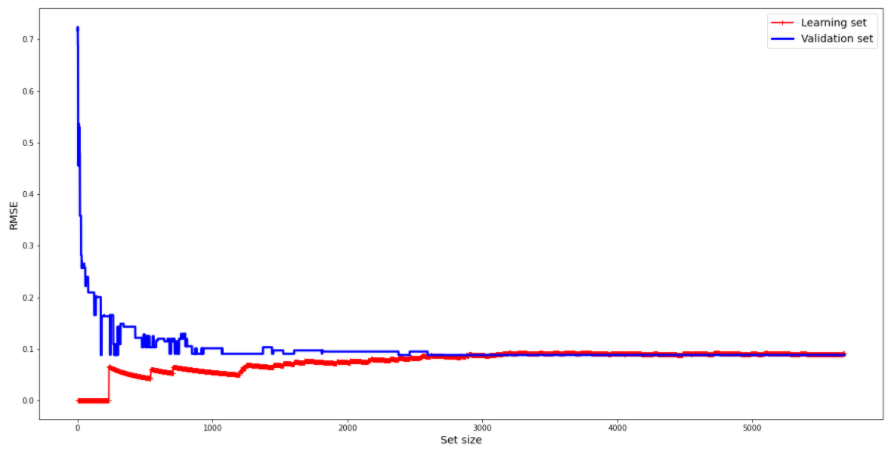

**Introduction**

This dataset includes descriptions of hypothetical samples corresponding to 23 species of gilled
mushrooms in the Agaricus and Lepiota Family Mushroom drawn from The Audubon Society Field
Guide to North American Mushrooms (1981). Each species is identified as definitely edible,
definitely poisonous, or of unknown edibility and not recommended. This latter class was combined
with the poisonous one. The Guide clearly states that there is no simple rule for determining the
edibility of a mushroom. Donated to UCI ML 27 April 1987.

**Analyzed problem**

We have given 23 attributes for mushrooms such as : 
cap-shape, cap-surface, cap-color, bruises, odor, gill-attachment, gill-spacing, gill-size, gill-color,
stalk-shape, stalk-root, stalk-surface-above-ring, stalk-surface-below-ring, stalk-color-above-ring,  
stalk-color-below-ring, veil-type, veil-color , ring-number, ring-type, spore-print-color, population,
habitat. 
*Mushrooms are labeled as poisonous or edible.*
The task is to use those features to classify mushrooms into one of the above groups.

**Purpose**

Build a mushroom classifier with the highest precision and find the most indicative features.

**Selected solution**

Use a decision tree classifier to recognize poisonous and edible mushrooms by their attributes.
Use different accuracy metrics and classification reports to assess classifier accuracy.
Try to use hyperparameter tuning to check if accuracy will change.

**Results and conclusions**

- Decision tree classifier obtain 99% accuracy and 99% of precision for classifying poisonous and edible mushrooms
- Metrics were proven by plotting the ROC curve and learning curves 
- Hyperparameter tuning with randomized search cv was conducted to evaluate the effect on the model performance
It doesn’t change accuracy score only took additional time for searching parameter and make new predictions to check accuracy again
- 2 methods of calculating accuracy were compared: ROC AUC score and accuracy score. 
Since the dataset is balanced ( there is so major class ) these 2 results did not differ
- the most indicative features for classifying if a mushroom  is poisonous are gill size and gill color.

**Quick project overview**

**Exploratory data analysis**

 
Due to dataset analyze we found out that around 30% of mushrooms have brown cup color,
 22% - gray and 18% - red.
 

The proportion between edible and poisonous mushrooms with brown and gray caps is
around 50%. Yellow and red caps are more characteristic of poisonous mushrooms (quite intuitive).
 
 

Almost 44% of  mushrooms have no odor, but:
- 26%: foul odor;
- 7%: fishy odor;
- 7%: spicy odor;
- 5%: almond odor;
- 5%: anise odor;
- 3%: pungent odor;
- 2%: creosote odor;
- 1%: musty odor.

Almost 96 % of mushrooms with no odor are edible, 100% of mushrooms with almond and anise
odor are also edible. All mushrooms with foul, fishy, spicy, pungent, creosote, or musty odor are
poisonous.

Nearly 50% of the mushrooms are the population type: several, then solitary (21,1%), scattered (15,4%)
and at the end numerous (4,9%), abundant ( 4,7% ), clustered (4,2%).

A certain percentage of 4 mushroom population types is poisonous:
    • 35% mushrooms in several population type
    •  8% of solitary population type
    • 4,5 % of scattered population type
    • 0,6 % of clustered population type.
    

    

**Correlation matrix**

Attributes that have a strong positive correlation with classes (coef>0,5) are:
*gill size and color (Pearson coefficient=0.54).* 
Attributes with weak positive correlation(0<coef<0.5 ):
*cap color, gill attachment, stalk root, stalk color above the ring, stalk color below the ring,
ring number, ring type.* 
Attributes with strong negative correlation(-1<coef<-0.5 ): *bruises.* 
Attributes with weak negative correlation(-0,5<coef<0 ): *cap shape, cap surface,
odor, gill spacing, stalk shape, stalk surface above the ring, stalk surface below the ring,
veil color, spore print color, population, habitat.*

   

**Build the model and check accuracy scores**

A decision tree classifier was built and trained. Accuracy score was calculated on predictions made
on a test subset. The accuracy of a model was 0.992%.  A classification report was generated.

To compare results with metrics from ROC AUC score, those metric has been calculated
and roc curve plotted.

To check if the model is not overfitting, learning curves were investigated.

The same process was conducted after hyperparameters tuning.
The accuracy score for the decision tree with tuning does not change. 
The same for the ROC curve and learning curves.

 

