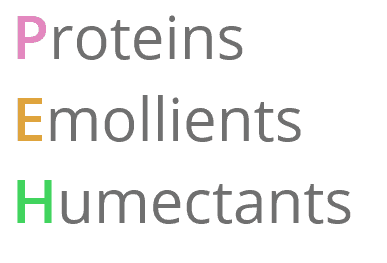
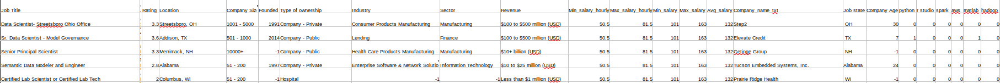
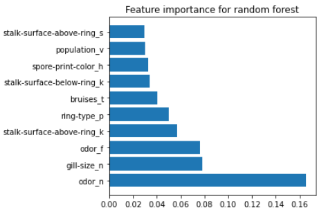

# Data-Science_Projects

This repository holds some of my personal projects which I've done
over last few months.
Currently they're classified into below categories:

 1. Complex and original data science project containing:
    web scraping, data cleaning, exploratory analysis, 
    model building and optimization: **PEH_Classifier**.
    
Aim of this project is to classify hair products into 3 categories 
    according to PEH balance based on ingredient list.
    

 2. Webscraping and data cleaning project: **Data_science_salary_predictions**
    
Project contains webscrapped data from glassdoor website with salary ranges.
    Dataset was cleaned and new features were extracted to prepare dataset
    for future predictions. Min-max salary, company name, job state, and
    encoded skills : everything ready to start building ML model.
    

 3. Dimensionality reduction techniques comparison - **Dimensionality_reduction**
    
Used different classification models to achieve the most accurate classifier
    on high dimension dataset. Investigated how dimensionality reduction
    algorithms affect accuracy and learning time and make dataset more
    understandable to the business.

 4. Classification problem with different classifiers and ensemble learning :
    **Ensemble_learning_with_mushroom_dataset**
    
    
Use different classifiers and their ensembles to recognize poisonous
and edible mushrooms by their attributes. Use different accuracy metrics
and classification report to assess classifier accuracy.
Examine feature importance for different algorithms.

 5. Classification problem with different accuracy metrics
    and learning curves: **Mushroom_classification**
    
Build mushroom classifier with the highest precision and
find the most indicative features.
 
